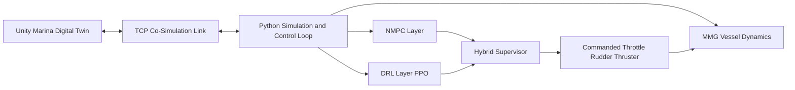

# Hybrid DRL + NMPC for Safe Autonomous Yacht Docking

## Executive Summary

This project delivers an end-to-end autonomous docking solution for a 40 m yacht operating in confined marina waters. The core innovation is a hybrid control stack that combines:

- A nonlinear model predictive controller (NMPC) for structured, constraint-aware guidance.
- A deep reinforcement learning policy (PPO) for agile obstacle avoidance and recovery.
- A supervisory layer that dynamically chooses the safer control mode in real time.

The result is a practical autonomy framework designed for high-risk, low-speed maneuvers where safety and reliability matter most.

## Business Impact

- Risk reduction in high-consequence docking operations through collision-free and timeout-free policy behavior.
- Improved operational confidence via interpretable supervision between optimization-based and learning-based control.
- Strong platform value for maritime autonomy R&D, training, and digital validation before real-world deployment.
- Reusable simulation and control architecture that supports extension toward hardware-in-the-loop and commercial autonomy workflows.

## Development Story

The system was developed as a full-stack autonomy pipeline, from vessel physics to intelligent decision-making:

1. A physics-based 3-DOF MMG maneuvering model was built for a 40 m yacht and tuned against maneuverability guidance.
2. An NMPC controller was designed to handle trajectory tracking with actuator-aware control of throttle, rudder, and bow thruster.
3. A PPO agent was trained in a structured avoid and recover task with reward shaping for safe behavior near obstacles.
4. A hybrid supervisor was implemented to hand over control between NMPC and DRL based on risk and phase progression.

This development approach produced a controller that is both robust and explainable in congested docking scenarios.

## Unity Digital Twin and Co-Simulation

Unity was used as the interactive maritime digital twin for scenario realism and visual validation:

- Marina scene with docking goals, confinement boundaries, and static or dynamic obstacles.
- Real-time TCP communication between Python control logic and Unity visualization.
- Continuous state streaming and command playback for live trajectory monitoring.
- Environment-level evidence generation for thesis reporting and performance analysis.

This bridge made it possible to test control decisions in realistic operational contexts, not just offline numerical simulation.

## Quantified Outcomes

| KPI | Baseline | Final |
|---|---:|---:|
| Timeout rate during training | 50% | 0% |
| Collision rate of baseline RL | 60% | 0% |
| Obstacle-avoidance success (DRL evaluation) | - | 100% |

Additional evaluation outcomes:

- 300-episode DRL evaluation: success 100%, collision 0%, timeout 0%.
- Avoid phase reached 100%, recover phase reached 100%.
- Average steps 934, P95 996, showing consistent completion.

## System View

## Evidence

- Thesis presentation and defense material.
- Runtime logs and summarized performance reports.
- Trained models and evaluation artifacts from hybrid validation runs.

## Author

Lemuel Hornsby-Odoi  
MSc Thesis Project, April 2026
