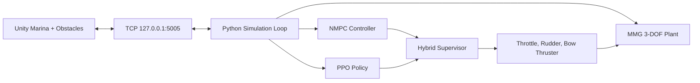

# Hybrid DRL + NMPC for Safe Autonomous Yacht Docking

Thesis project on autonomous docking of a 40 m yacht in confined marina waters using a hybrid controller:

- NMPC for structured tracking and safety.
- PPO-based DRL for avoidance and recovery maneuvers.
- A supervisor that switches between both layers in real time.

## Highlights

- Built a 3-DOF MMG yacht model and validated maneuvering behavior against ABS guidance.
- Developed a Unity co-simulation environment with TCP Python-Unity communication and static/dynamic obstacles.
- Designed a nonlinear MPC with throttle, rudder, and bow-thruster control inputs.
- Trained a PPO policy for avoid/recover phases with robust reward shaping.

## Results

| Metric | Baseline | Final |
|---|---:|---:|
| Timeout rate (training) | 50% | 0% |
| Collision rate (baseline RL) | 60% | 0% |
| Obstacle-avoidance success (DRL eval) | - | 100% |

Additional evaluation evidence:

- DRL evaluation (300 episodes): success 100%, collision 0%, timeout 0%.
- Avoid reached 100%, recover reached 100%.
- Avg steps: 934, P95: 996.

## Architecture



## Main Files

- Vessel dynamics: `mmg_setup_yacht.py`, `mmg_setup_yacht_bowthruster.py`, `simulate_yacht_mmg_bowthruster.py`
- NMPC: `casadi_yacht_model.py`, `nmpc_casadi_yacht.py`, `unity_nmpc_casadi.py`
- DRL: `drl_avoid_env.py`, `train_drl_avoid.py`, `evaluate_drl_avoid.py`
- Hybrid controller: `run_hybrid_supervisor.py`
- Unity bridge: `PythonTCPReceiver.cs`, `YachtPoseApplier.cs`

## Quick Run

```bash
python train_drl_avoid.py --model-dir models/hybrid_strict_2m --timesteps 2000000
python evaluate_drl_avoid.py --model-dir models/hybrid_strict_2m
python run_hybrid_supervisor.py --model-dir models/hybrid_strict_2m
python analyze_hybrid_runtime.py --csv logs/hybrid_runtime_latest.csv --report-json logs/hybrid_runtime_latest_summary.json
python plot_hybrid_trajectory.py --runtime-csv logs/hybrid_runtime_latest.csv --output plots/hybrid_trajectory_latest.png
```

## Evidence

- Presentation: `Lemuel_Hornsby_Odoi_Final.pptx`
- Runtime logs: `logs/hybrid_runtime_latest.csv`, `logs/hybrid_runtime_latest_summary.json`
- Trained models and evaluations: `models/`

## Author

Lemuel Hornsby-Odoi  
MSc Thesis Project, April 2026
