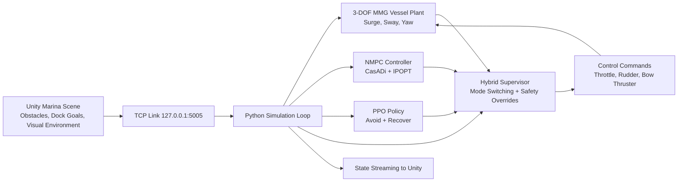

<h1 align="center">Hybrid DRL + NMPC for Safe Autonomous Yacht Docking</h1>
<p align="center">
  <b>Thesis Project:</b> Hybrid Deep Reinforcement Learning and Model Predictive Control for Safe Autonomous Docking of Yachts in Confined Waters
</p>

<p align="center">
  
  
  
  
  
</p>

## Project Summary

This repository contains my full thesis implementation for autonomous docking of a 40 m yacht in confined marina waters using a hybrid control strategy:

- NMPC for structured trajectory tracking and safety-oriented behavior.
- Deep RL (PPO) for dynamic obstacle avoidance and recovery maneuvers.
- Supervisor logic that switches between NMPC and DRL based on situational risk and mission phase.

The project combines vessel dynamics, optimal control, deep reinforcement learning, and real-time Python-Unity co-simulation.

## Key Achievements

- Conducted research on hybrid DRL-NMPC control for safe autonomous yacht docking in confined waters.
- Developed a physics-based 3-DOF MMG maneuvering model for a 40 m yacht and validated performance against ABS maneuverability guidance.
- Built a realistic Unity marine simulation with water effects, obstacles, buoyancy-ready scene components, and Python-Unity TCP integration.
- Modeled a nonlinear MPC controller with throttle, rudder, and thruster inputs for autonomous docking in congested environments.
- Developed and trained a PPO policy for obstacle avoidance and docking phase behaviors.
- Reduced training timeout rate from 50% to 0%.
- Reduced baseline RL collision rate from 60% to 0%.
- Achieved 100% obstacle avoidance success during DRL evaluation runs.
- Delivered a hybrid supervisory controller where NMPC acts as a safety layer and DRL acts as a dynamic maneuvering layer.

## Results Snapshot

| Metric | Before / Baseline | Final Outcome |
|---|---:|---:|
| Timeout rate during training | 50% | 0% |
| Collision rate (baseline RL) | 60% | 0% |
| Obstacle avoidance success (DRL eval) | - | 100% |
| Hybrid supervisory architecture | Not integrated | NMPC safety + DRL dynamic layer |

### Presentation-Backed Performance Highlights

- DRL evaluation (300 episodes): success 100%, collision 0%, timeout 0%.
- Avoid milestone reached 100%, recover milestone reached 100%.
- Average episode steps: 934 (P95: 996), indicating stable completion behavior.
- Hybrid runtime example: duration 368.8 s, mean sample time about 0.050 s, mode transitions = 2.

Evidence is reflected in:

- Presentation: `Lemuel_Hornsby_Odoi_Final.pptx`
- Runtime logs: `logs/hybrid_runtime_latest.csv`, `logs/hybrid_runtime_latest_summary.json`
- Trained policies and evaluation artifacts under `models/`
- Validation package under `hybrid_validate/`

## System Architecture



## Core Technical Components

### 1) Vessel Dynamics (MMG, 3-DOF)

- Primary files:
  - `mmg_setup_yacht.py`
  - `mmg_setup_yacht_bowthruster.py`
  - `simulate_yacht_mmg.py`
  - `simulate_yacht_mmg_bowthruster.py`
- Models surge, sway, yaw using Newton-Euler + MMG force decomposition:
  - Hull hydrodynamics
  - Propeller thrust
  - Rudder lift/drag
  - Bow-thruster lateral/yaw contribution

### 2) Nonlinear MPC (CasADi)

- Primary files:
  - `casadi_yacht_model.py`
  - `nmpc_casadi_yacht.py`
  - `unity_nmpc_casadi.py`
- Implements constrained NMPC with:
  - RK4 integration
  - Actuator and state limits
  - Obstacle keep-out constraints
  - Tunable stage and terminal costs

### 3) Deep RL (PPO) for Avoid/Recover

- Primary files:
  - `drl_avoid_env.py`
  - `drl_avoid_common.py`
  - `train_drl_avoid.py`
  - `evaluate_drl_avoid.py`
  - `diagnose_drl_avoid.py`
- Implements a phase-aware Gymnasium environment and trains PPO policies with safety-shaping and geometric allowances.

### 4) Hybrid Supervisor

- Primary file:
  - `run_hybrid_supervisor.py`
- Combines NMPC and DRL through mode switching and safety overrides:
  - NMPC for nominal route tracking
  - DRL for avoid/recover windows near obstacles
  - Handoff back to NMPC when safe release criteria are met

### 5) Unity Co-Simulation Layer

- Primary files:
  - `PythonTCPReceiver.cs`
  - `YachtPoseApplier.cs`
  - `DockingGoalTrigger.cs`
  - `MarinaObstacle.cs`
  - `MarinaScenarioExporter.cs`
- Handles real-time JSON state/command exchange over TCP and applies vessel pose updates in Unity.

## Repository Layout

```text
.
|- README.md
|- Lemuel_Hornsby_Odoi_Final.pptx
|- marinas_export.json
|- mmg_setup_yacht.py
|- mmg_setup_yacht_bowthruster.py
|- casadi_yacht_model.py
|- nmpc_casadi_yacht.py
|- drl_avoid_env.py
|- drl_avoid_common.py
|- train_drl_avoid.py
|- evaluate_drl_avoid.py
|- run_hybrid_supervisor.py
|- unity_nmpc_casadi.py
|- PythonTCPReceiver.cs
|- YachtPoseApplier.cs
|- models/
|- logs/
|- plots/
|- hybrid_validate/
```

## Quick Reproduction Guide

### Prerequisites

- Python 3.10+
- Unity (project scene with the included C# bridge components)
- Python packages used by this codebase:
  - casadi
  - numpy
  - gymnasium
  - stable-baselines3
  - matplotlib

### Typical Workflow

1. Train PPO policy

```bash
python train_drl_avoid.py --model-dir models/hybrid_strict_2m --timesteps 2000000
```

2. Evaluate policy

```bash
python evaluate_drl_avoid.py --model-dir models/hybrid_strict_2m
```

3. Run hybrid supervisor (NMPC + DRL)

```bash
python run_hybrid_supervisor.py --model-dir models/hybrid_strict_2m
```

4. Analyze and plot results

```bash
python analyze_hybrid_runtime.py --csv logs/hybrid_runtime_latest.csv --report-json logs/hybrid_runtime_latest_summary.json
python plot_hybrid_trajectory.py --runtime-csv logs/hybrid_runtime_latest.csv --output plots/hybrid_trajectory_latest.png
```

## Thesis Contributions

This work demonstrates a practical and interpretable hybrid autonomy stack for marine docking:

- Physics-informed vessel model for realistic closed-loop behavior.
- Learning-enabled maneuver agility near obstacles.
- Optimization-based safety and structure through NMPC.
- Real-time co-simulation architecture suitable for future HIL and field-transfer research.

## Future Extensions

- Domain randomization and sensor-noise injection to reduce simulation-to-reality gap.
- Hardware-in-the-loop evaluation and latency robustness tests.
- Multi-vessel and COLREG-aware interaction scenarios.
- Full 6-DOF coupling for advanced low-speed effects.
- Energy-aware docking objectives for electric propulsion.

## Author

Lemuel Hornsby-Odoi  
MSc Thesis Project, April 2026
